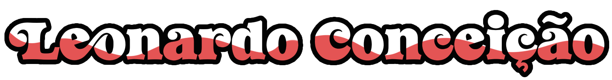
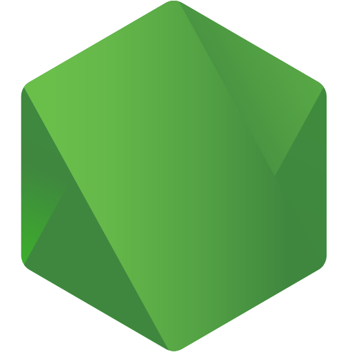
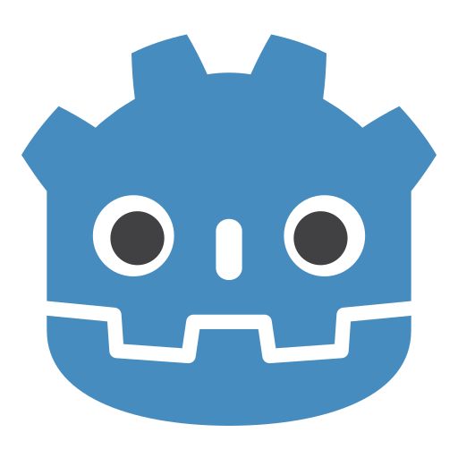
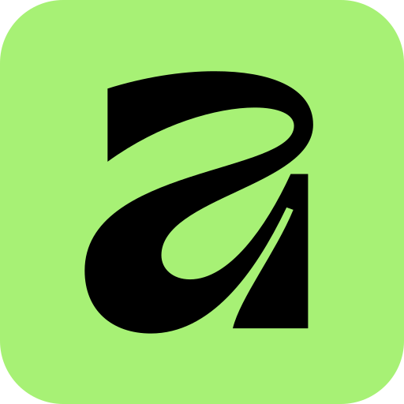
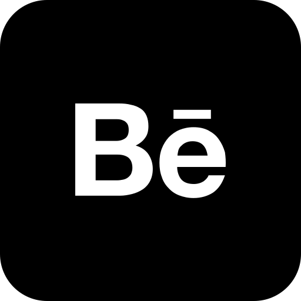
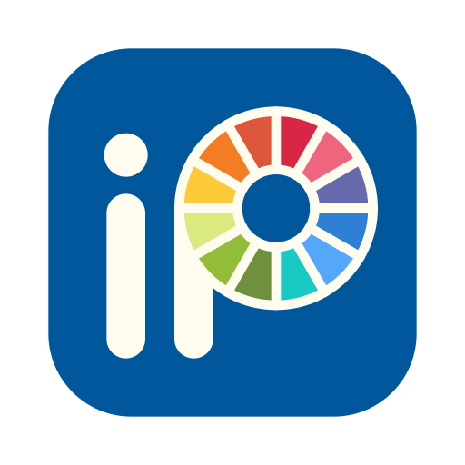
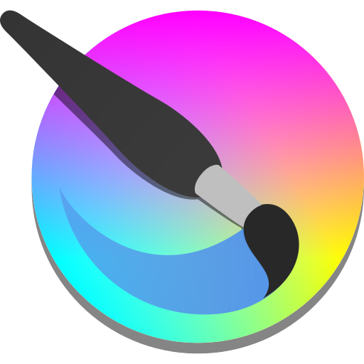
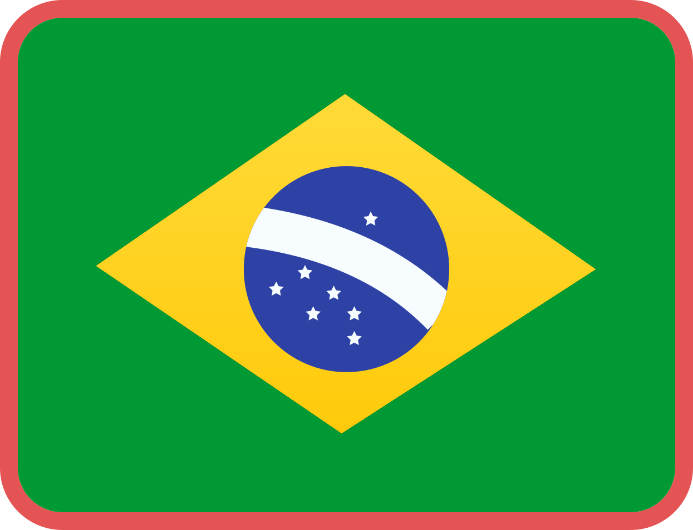
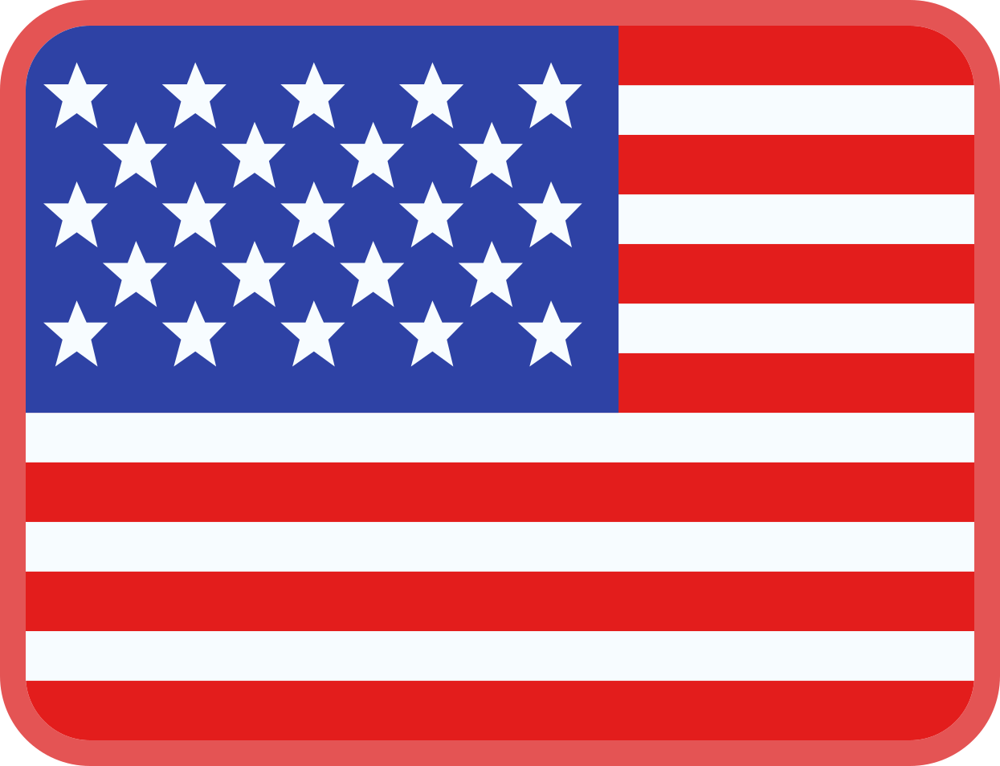

<!--  README_EN — Leonardo Matheus — @leooty — English Version -->

<!-- ══════════════════ BANNER ══════════════════ -->

  

  

  <strong>Full Stack Developer in Training&nbsp; | &nbsp;Programmer&nbsp; | &nbsp;Scripter</strong>

<!-- ══════════════════ TYPING ══════════════════ -->

  

---

<!-- ══════════════════ ABOUT ME ══════════════════ -->

<table border="0" cellpadding="16" cellspacing="0">
<tr>

<td valign="top" width="58%">

### ✦ Hello, I'm Leonardo!

<table border="0" cellpadding="12" cellspacing="0">
<tr>
<td bgcolor="#111111" style="border-radius: 12px;">

✦ **Name:** Leonardo Matheus Nicolau da Conceição  
✦ **Username:** @leooty  
✦ **Location:** Rio de Janeiro, Brazil  
✦ **Course:** Systems Analysis and Development  
✦ **Semester:** 4th semester — in progress  
✦ **Goal:** Full Stack Developer  

</td>
</tr>
</table>

</td>

<td valign="top" width="42%" align="center">

<!-- GIF/ANIMATION -->

 

<!-- VISITOR COUNTER -->

 

</td>

</tr>
</table>

---

<!-- ══════════════════ TYPING 2 ══════════════════ -->

---

<!-- Text -->

<td valign="middle" width="58%">

### ✦ About Me

I am a student of <strong>Systems Analysis and Development (ADS)</strong> and I am always looking to learn, experiment, and grow in the technology field. I enjoy turning ideas into projects and exploring new possibilities through programming.

Besides programming itself, I also have knowledge of <strong>design</strong>, but at the moment, my main focus is on creating <strong>code scripts using Lua</strong>, working with logic, mechanics, events, and system development for games.

I am also passionate about <strong>games, video games, manga, and anime</strong>, without having a single favorite, as there are many that I enjoy. Currently, I am improving my skills in <strong>programming, logic, game development, and design</strong>, always looking for new challenges and opportunities to learn.

<strong>✦ Interests:</strong> Technology • Programming • Game Programmer • Design • Games • Scripter

</td>

<!-- ══════════════════ CONTACT ══════════════════ -->
## Contact

 

  
  &nbsp;&nbsp;
  

<!-- ══════════════════ TECH STACK ══════════════════ -->
## Tech Stack

<table>
  <tr>
    <td align="center" width="110" height="110">
      
       
      <b>JavaScript</b>
    </td>
    <td align="center" width="110" height="110">
      
       
      <b>TypeScript</b>
    </td>
    <td align="center" width="110" height="110">
      
       
      <b>HTML5</b>
    </td>
    <td align="center" width="110" height="110">
      
       
      <b>CSS3</b>
    </td>
    <td align="center" width="110" height="110">
      
       
      <b>PHP</b>
    </td>
    <td align="center" width="110" height="110">
      
       
      <b>Python</b>
    </td>
    <td align="center" width="110" height="110">
      
       
      <b>Node.js</b>
    </td>
    <td align="center" width="110" height="110">
      
       
      <b>React</b>
    </td>
  </tr>
  <tr>
    <td align="center" width="110" height="110">
      
       
      <b>Next.js</b>
    </td>
    <td align="center" width="110" height="110">
      
       
      <b>Angular</b>
    </td>
    <td align="center" width="110" height="110">
      
       
      <b>Vue</b>
    </td>
    <td align="center" width="110" height="110">
      
       
      <b>Sass</b>
    </td>
    <td align="center" width="110" height="110">
      
       
      <b>Tailwind</b>
    </td>
    <td align="center" width="110" height="110">
      
       
      <b>MySQL</b>
    </td>
    <td align="center" width="110" height="110">
      
       
      <b>PostgreSQL</b>
    </td>
    <td align="center" width="110" height="110">
      
       
      <b>Firebase</b>
    </td>
  </tr>
  <tr>
    <td align="center" width="110" height="110">
      
       
      <b>XAMPP</b>
    </td>
    <td align="center" width="110" height="110">
      
       
      <b>Bootstrap</b>
    </td>
    <td align="center" width="110" height="110">
      
       
      <b>Ionic</b>
    </td>
    <td align="center" width="110" height="110">
      
       
      <b>Ruby</b>
    </td>
    <td align="center" width="110" height="110">
      
       
      <b>Git</b>
    </td>
    <td align="center" width="110" height="110">
      
       
      <b>Linux</b>
    </td>
    <td align="center" width="110" height="110">
      
       
      <b>Markdown</b>
    </td>
    <td align="center" width="110" height="110">
      
       
      <b>Vite</b>
    </td>
  </tr>
  <tr>
    <td align="center" width="110" height="110">
      
       
      <b>Copilot</b>
    </td>
    <td align="center" width="110" height="110">
      
       
      <b>VSCode</b>
    </td>
    <td align="center" width="110" height="110">
      
       
      <b>Android</b>
    </td>
    <td align="center" width="110" height="110">
      
       
      <b>Godot</b>
    </td>
    <td align="center" width="110" height="110">
      
       
      <b>Blender</b>
    </td>
    <td align="center" width="110" height="110">
      
       
      <b>Figma</b>
    </td>
    <td align="center" width="110" height="110">
      
       
      <b>Penpot</b>
    </td>
    <td align="center" width="110" height="110">
      
       
      <b>Affinity</b>
    </td>
  </tr>
  <tr>
    <td align="center" width="110" height="110">
      
       
      <b>Behance</b>
    </td>
    <td align="center" width="110" height="110">
      
       
      <b>Ibis Paint X</b>
    </td>
    <td align="center" width="110" height="110">
      
       
      <b>Clip Studio</b>
    </td>
    <td align="center" width="110" height="110">
      
       
      <b>Krita</b>
    </td>
    <td align="center" width="110" height="110">
      
       
      <b>Aseprite</b>
    </td>
    <td align="center" width="110" height="110">
      
       
      <b>Notion</b>
    </td>
    <td align="center" width="110" height="110">
      
       
      <b>Trello</b>
    </td>
    <td align="center" width="110" height="110">
      
       
      <b>Lua</b>
    </td>
  </tr>
</table>
 

<!-- SPECIAL LOGOS -->
&nbsp;&nbsp;
&nbsp;&nbsp;
&nbsp;&nbsp;

<!-- BADGES -->

  
  &nbsp;
  
  &nbsp;
  

---

<!-- ══════════════════ GITHUB STATS ══════════════════ -->
## GitHub Stats

  

---

<!-- ══════════════════ ACTIVITY ══════════════════ -->
## Activity

  

---

<!-- ══════════════════ PERSONAL INSTAGRAM ══════════════════ -->
## Instagram

Follow along to learn a little more about me, my projects, interests, and what I do outside of coding.

 

 

---

<!-- ══════════════════ FOOTER ══════════════════ -->

 
  Made with dedication by <strong>Leonardo Matheus</strong> · <a href="https://github.com/leooty">@leooty</a>
   
  <em>"Improving myself every day."</em>

---

<!-- ══════════════════ FLAGS / LANGUAGE ══════════════════ -->

  
  &nbsp;&nbsp;
  

